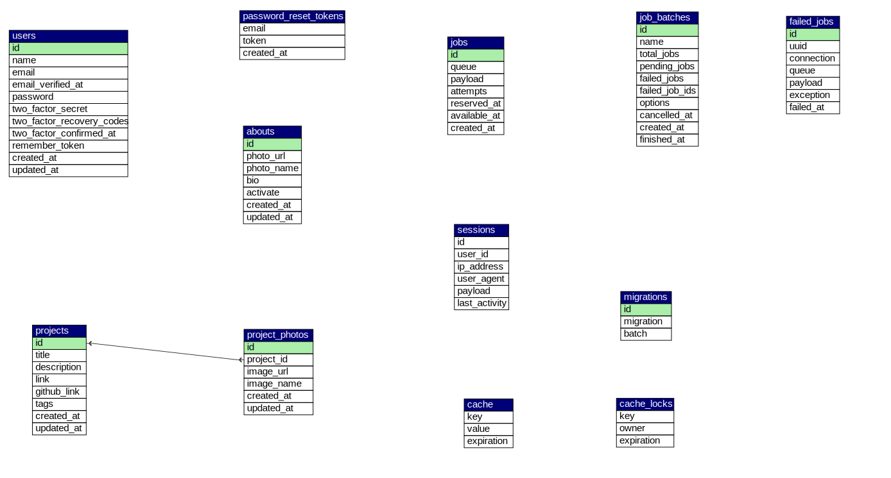

# PTO - Portfolio Website

PTO is a dynamic portfolio application designed for developers to manage and showcase their work efficiently. Built on a modern stack using **Laravel** and **Inertia.js (React)**, it functions as a single-user CMS where only the owner can manage content. Key features include a secure dashboard for creating and editing projects, support for multiple images per project via **Google Cloud Storage**, and a dedicated "About" section for biographical management.

## Features

- **Single-User Authentication**: Registration is restricted to a single user (the website owner). Only this user can access the dashboard to create, edit, or delete content.
- **Project Management**:
  - Create, read, update, and delete projects.
  - **One-to-Many Relationship**: A single project can have multiple images (Project Photos).
- **About Section**:
  - Manage biographical information.
  - **One-to-One Relationship**: The About section supports a single profile image.
- **Cloud Storage**: Integrated with Google Cloud Storage (GCS) for secure and scalable image hosting.

## Entity Relationship Diagram (ERD)

The database schema visualizes the relationships between Projects, Project Photos, Abouts, and the User.



## Directory Structure

```text
pto/
├── app/
│   ├── Http/              # Controllers, Middleware, Requests
│   ├── Models/            # Eloquent Models (Project, ProjectPhoto, About, User)
│   └── Providers/
├── bootstrap/             # Framework bootstrapping
├── config/                # Application configuration
├── database/
│   ├── factories/
│   ├── migrations/        # Database schemas
│   └── seeders/           # Database seeders
├── public/                # Web root (index.php, assets)
├── resources/
│   ├── css/
│   ├── js/                # React components, Pages, Inertia setup
│   └── views/             # Blade templates (root view)
├── routes/                # Web and API routes
├── storage/               # Logs, compiled templates
├── tests/                 # Feature and Unit tests
├── vendor/                # Composer dependencies
├── .env.example           # Environment variable template
├── composer.json          # PHP dependencies
├── package.json           # JS dependencies
├── pto.svg                # Database Schema Image
├── README.md              # Project Documentation
└── vite.config.js         # Vite asset bundling configuration
```

## Environment Setup

### Google Cloud Storage (GCS)

This project uses GCS for storing images. Ensure your `.env` file is configured with the necessary credentials.

```ini
FILESYSTEM_DISK=gcs

# GCS Credentials (using S3 interoperability or custom driver)
AWS_ACCESS_KEY_ID=your-hmac-access-key
AWS_SECRET_ACCESS_KEY=your-hmac-secret
AWS_DEFAULT_REGION=us-east-1
AWS_BUCKET=your-gcs-bucket-name
AWS_USE_PATH_STYLE_ENDPOINT=false
```

### Installation

1.  **Clone the repository**:
    ```bash
    git clone <repository-url>
    cd pto
    ```

2.  **Install Dependencies**:
    ```bash
    composer install
    npm install
    ```

3.  **Environment Configuration**:
    ```bash
    cp .env.example .env
    php artisan key:generate
    ```

4.  **Database Migration**:
    ```bash
    php artisan migrate
    ```

5.  **Build Assets**:
    ```bash
    npm run build
    ```
